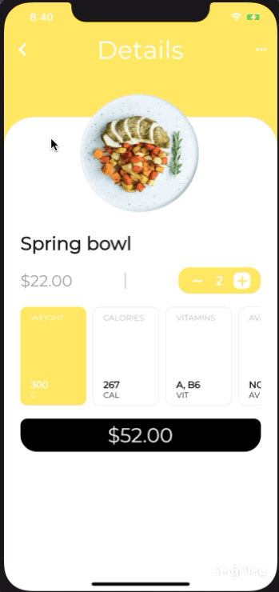

<h1 align="center">
   Hungry App - A Flutter Food App
</h1>

 

   <a href="#-projeto">Project</a>&nbsp;&nbsp;&nbsp;&nbsp;&nbsp;&nbsp;
 

 

    
 

 ## 💻 Projeto

Food app developed using Flutter. Layout and Color Scheme also picked by me

 ---
<h4 align="center">
   Code and coffee ☕
</h4>
